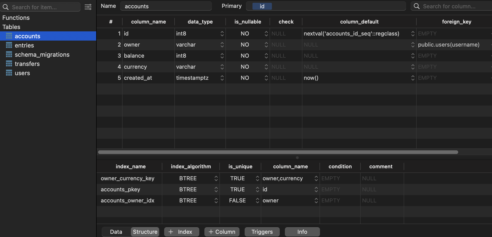
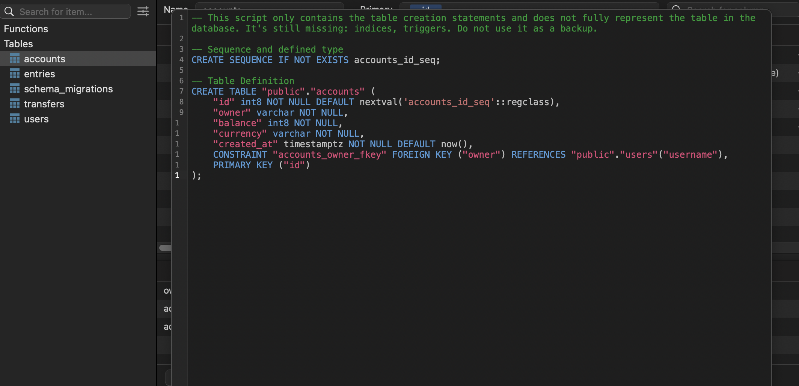

# GopherBank

- Create and manage account

  - Owner, balance, currency

- Record all balance changes

  - Create an account entry for each change

- Money transfer transaction
  - Perform money transfer between 2 accounts consistently within a transaction.

# Database Design

- Design a SQL DB schema using dbdiagram.io
- Save it in PNG/PDF diagram
- Generate code to create a schema in a target db engine: Postgres/MySQL/SQL Server

# Install Docker & Postgres + TablePlus

- install docker desktop
- find official docker postgress image
-

# DB Migration

- golang-migrate library to write and read db migration : https://github.com/golang-migrate/migrate
- Up and down script for migration schema , why ?
- Up for any change in current migration
- Down for revert changes in migration

```
╭─scortier@Infinity ~
╰─$ docker stop ps_name                                                           127 ↵
ps_name
╭─scortier@Infinity ~
╰─$ docker start ps_name
ps_name
╭─scortier@Infinity ~
╰─$ docker ps
CONTAINER ID   IMAGE             COMMAND                  CREATED          STATUS         PORTS                    NAMES
2d1f2ae8b71f   postgres:latest   "docker-entrypoint.s…"   57 minutes ago   Up 5 seconds   0.0.0.0:5432->5432/tcp   ps_name
╭─scortier@Infinity ~
╰─$ docker exec -it ps_name /bin/sh
# psql gopherbank
psql: error: connection to server on socket "/var/run/postgresql/.s.PGSQL.5432" failed: FATAL:  database "gopherbank" does not exist
# createdb --username=root --owner=root gopherbank
# psql gopherbank
psql (15.4 (Debian 15.4-1.pgdg120+1))
Type "help" for help.

gopherbank=# \q
# dropdb gopherbank
# exit
╭─scortier@Infinity ~
╰─$ docker exec -it ps_name createdb --username=root --owner=root gopherbank
╭─scortier@Infinity ~
╰─$ docker exec -it ps_name psql -U root  gopherbank
psql (15.4 (Debian 15.4-1.pgdg120+1))
Type "help" for help.

gopherbank=# \q
```

# Generate Golang code from SQLC

- create sqlc.yaml
- use this : https://docs.sqlc.dev/en/v1.21.0/tutorials/getting-started-postgresql.html

```
version: "2"
sql:
  - engine: "postgresql"
    queries: "./db/query/"
    schema: "./db/migration/"
    gen:
      go:
        package: "db"
        out: "./db/sqlc"

```

- use create, get, update queries in query.sql and `make sqlc` to create corresponding code files.

# DB Transaction

- Each Query can do only 1 operation on 1 specific table
- storing query inside store is called composition, it is preferred way to extend struct functionality in go instead of inheritance.
- All individual function provided by queries will be available to store and we can support tx by adding more func to that new struct(Store)
- Issue : after one trans, fromAcc balance was not updated immedialtely which was leading issue in simultaneous tx,
  Sol: Add `For UPDATE` clause at the end of GetList

```
-- name: GetAccountForUpdate :one
SELECT * FROM accounts
WHERE id = $1 LIMIT 1
FOR NO KEY UPDATE;
```

- After above changes, that problem is resolved but now deadlock issue will arrive
  
- so the deadlock happends from `SELECT statement`: https://wiki.postgresql.org/wiki/Lock_Monitoring
  
- 

- the only conn between account and transfer schema is foreign key
  - ALTER TABLE "transfers" ADD FOREIGN KEY ("to_account_id") REFERENCES "accounts" ("id");
  - from_acc_id and to_acc_id of transfer table are referring to the id column of accounts table. So any affect on account id will ffect the foreign key constraint.
  - That'swhy when we select an account for update. it needs to acquire a lock to prevent conflict and ensure onsistency in the data.
  - To check again just run , create entry for acc 1 and 2 and select acc1 for update in tx1, you will geta deadlock,
      
    becoz both tx1 and tx2 has to wait for each other.
- HOW TO FIX IT ?

  - Remove foreign key
  - update db schema , just by not changing id while updating. Tell postgres to udpate acc but u will not touch its primary key. hence no tx lock , so no deadlock.

```
  -- name: GetAccountForUpdate :one
  SELECT * FROM accounts
  WHERE id = $1 LIMIT 1
  FOR UPDATE;

- Below NO KEY is added in last line.
-- name: GetAccountForUpdate :one
SELECT \* FROM accounts
WHERE id = $1 LIMIT 1
FOR NO KEY UPDATE;

```

- To avoid duplication of code of fetchign and updating balance in both accounts

```
		fromAcc, err := q.GetAccountForUpdate(ctx, arg.FromAccountID) // get account
		if err != nil {
			return err
		}

		result.FromAccount, err = q.UpdateAccount(ctx, UpdateAccountParams{
			ID:      arg.FromAccountID,
			Balance: fromAcc.Balance - arg.Amount,
		}) // update account
		if err != nil {
			return err
		}
```

- we can simplify this by adding the update query of account

```
FROM:
-- name: UpdateAccount :one
UPDATE accounts
SET balance = $2
WHERE id = $1
RETURNING *;

TO:
-- name: AddAccountBalance :one
UPDATE accounts
SET balance = balance + sqlc.arg(amount)
WHERE id = sqlc.arg(id)
RETURNING *;

// SET balance = balance + $2 is also fine. but we want to update struct field to new value name , here it will be amount that's why added sqlc.arg(amount)
```

- now also it will give deadlock issue, when two tx are happening simultaneously from 1->2 and form 2->1.
  
- to resolve it just go with smaller -> larger id order in tx.
- update the code accordingly

```
UPDATED CODE.
if arg.FromAccountID < arg.ToAccountID {
			// fromAcc is updated first, then toAcc
			result.FromAccount, result.ToAccount, err = addMoney(ctx, q, -arg.Amount, arg.FromAccountID, +arg.Amount, arg.ToAccountID)
			if err != nil {
				return err
			}
		} else {
			// toAcc is updated first, then fromAcc
			result.ToAccount, result.FromAccount, err = addMoney(ctx, q, +arg.Amount, arg.ToAccountID, -arg.Amount, arg.FromAccountID)
			if err != nil {
				return err
			}
		}

```

# 5 Testing

- Indirect tag in go.mod comes when package is not used in that project.
- testify is used for result checking like require function
- after running test in account test, check in tableplus also, to verify
- each test should be independent as much as possible. So that later on its easy to modify.

# 11 REST API using Gin

- `router.POST("/accounts", server.createAccount)` here, if you pass multiple handler then last one should be main handler previos it should be middleware.
- in api/account.go
  // why using ctx here ? Becoz in POST request, handler function takes a context as a parameter, when using gin
  // everything we do inside the handler will involve this context obj. Also it provides lot of convenient methods
  // read input param and write out response.
  `func (server *Server) createAccount(ctx *gin.Context) {}`
- gin uses validator package internally.
- Both `log.Fatalf` and `log.Errorf` both format string by taking arg but
  - `log.Errorf` is used to log an error message, but it does not terminate the program. It is often used for non-fatal errors that should be logged for diagnostic purposes but should not cause the program to exit.
  - `log.Fatalf` is used to log an error message and then immediately terminate the program (exit with a non-zero status code). It is typically used for fatal errors that should lead to an immediate program termination.
- POST request call
  
- Request of logs by gin in proper format :
  

- ### Calculating the Offset:

  To skip the correct number of records to reach the desired page, you need to calculate the Offset. The formula for calculating the offset is:
  mathematica
  Copy code
  Offset = (Page Number - 1) \* Page Size
  For the first page (PageID = 1), Offset would be 0, so you start from the beginning.
  For the second page (PageID = 2), Offset would be 10, so you skip the first 10 records.
  For the third page (PageID = 3), Offset would be 20, so you skip the first 20 records.
  And so on...

- List Account API is not returning any response but showing response, check it afterwards.

# 12: Load config using viper

- why env vars ?

  - Easily override the deafult configuration when deploy with docker containers.

- why viper ?
  - find, load, unmarshal config file.: JSON,TOML,YAML,ENV,INI
  - Read config from env var or flags.: override existing val, set default values
  - Read config from remote system.: Etcd, Consul
  - Live watching and writing config file: Reread changed file, save any modifications.

# 14 Custom Param validator in GO

- used : "github.com/go-playground/validator/v10", for validating
- after checking tx api through postman, check db tx in tableplus, by checking tx details, fromAcc and toAcc money updation, where tx is recorded in db.

# 15 Add user table with unique and foreign key constraints in postgres

- never store pass in db, store a hash pass
- `migrate create -ext sql -dir db/migration -seq add_users` to create new dbmigration as in prod code, updating existing one is not feasible approach as its deployed while changeing it can break thing instead create new version whenever something you change with db.
- first do migrate down then migrate up as exisitng data will give error for foreign key, version of 2 will also be dirty as true (for checking purpose).
- 
- TO check foreign key for owner field : Go to TabelPlus in account table, click INFO button
  

-
