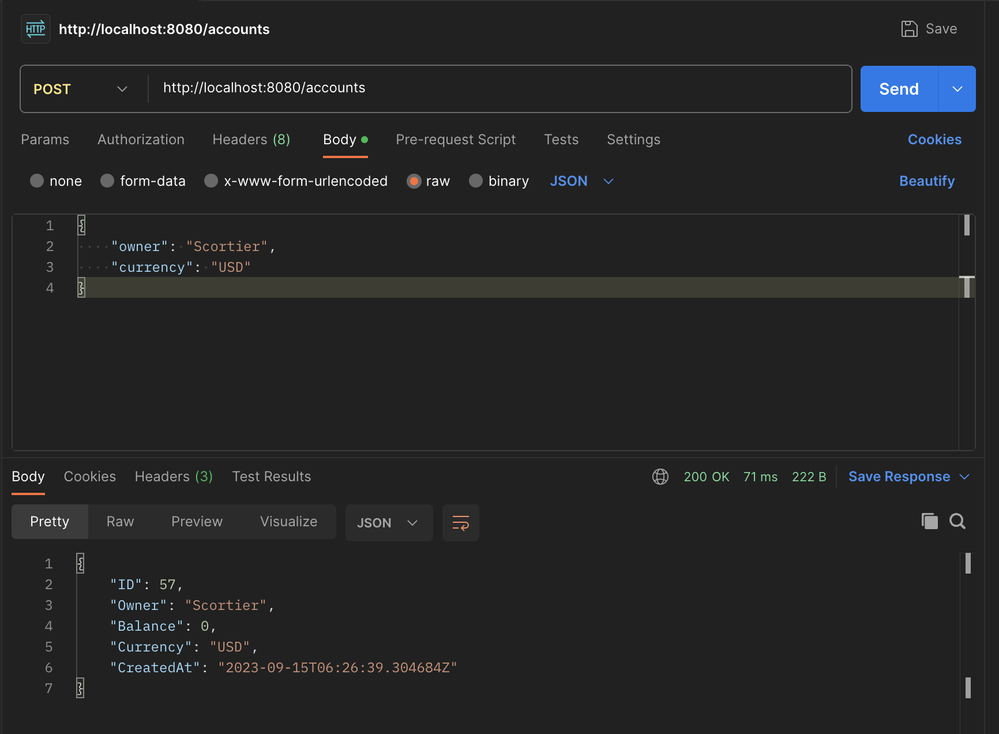
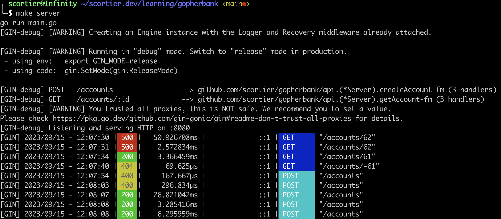

# 5 Testing

- Indirect tag in go.mod comes when package is not used in that project.
- testify is used for result checking like require function
- after running test in account test, check in tableplus also, to verify
- each test should be independent as much as possible. So that later on its easy to modify.

# 11 REST API using Gin

- `router.POST("/accounts", server.createAccount)` here, if you pass multiple handler then last one should be main handler previos it should be middleware.
- in api/account.go
  // why using ctx here ? Becoz in POST request, handler function takes a context as a parameter, when using gin
  // everything we do inside the handler will involve this context obj. Also it provides lot of convenient methods
  // read input param and write out response.
  `func (server *Server) createAccount(ctx *gin.Context) {}`
- gin uses validator package internally.
- Both `log.Fatalf` and `log.Errorf` both format string by taking arg but
  - `log.Errorf` is used to log an error message, but it does not terminate the program. It is often used for non-fatal errors that should be logged for diagnostic purposes but should not cause the program to exit.
  - `log.Fatalf` is used to log an error message and then immediately terminate the program (exit with a non-zero status code). It is typically used for fatal errors that should lead to an immediate program termination.
- POST request call
  
- Request of logs by gin in proper format :
  

- ### Calculating the Offset:

  To skip the correct number of records to reach the desired page, you need to calculate the Offset. The formula for calculating the offset is:
  mathematica
  Copy code
  Offset = (Page Number - 1) \* Page Size
  For the first page (PageID = 1), Offset would be 0, so you start from the beginning.
  For the second page (PageID = 2), Offset would be 10, so you skip the first 10 records.
  For the third page (PageID = 3), Offset would be 20, so you skip the first 20 records.
  And so on...

- List Account API is not returning any response but showing response, check it afterwards.
